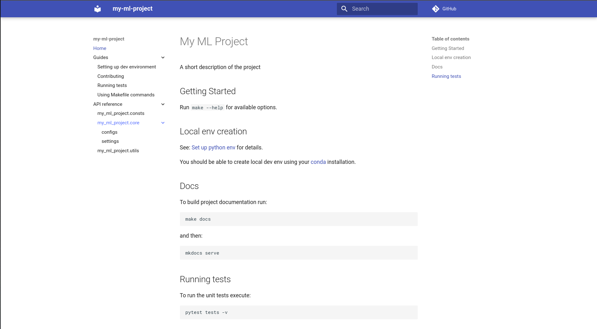

# Getting started

## Requirements

- Read: [Cookiecutter Data Science Docs](http://drivendata.github.io/cookiecutter-data-science/) for a general overview
- Python 3.11+
- [Conda](https://conda.io/en/latest/miniconda.html)
- [Cookiecutter Python package](http://cookiecutter.readthedocs.org/en/latest/installation.html) >= 2.1.1:
    This can be installed with `pip` by or `conda` depending on how you manage your Python packages:

```shell
conda install -c conda-forge cookiecutter
```

- [conda-lock](https://github.com/conda/conda-lock)

```shell
conda install -c conda-forge conda-lock -n base
```

## Creating new project

Run:

```shell
cookiecutter https://github.com/xultaeculcis/ml-project-cookiecutter
```

You will be prompted to provide project info one argument at a time:

```
project_name (project_name): My ML project
repo_name (my-ml-project):
src_dir_name (src):
author_name (Your name (or your organization/company/team)): xultaeculcsis
repo_url (https://github.com/xultaeculcsis/my-ml-project):
project_description (A short description of the project): Just an ML project :)
Select python_version
1 - 3.11
2 - 3.12
3 - 3.13
Choose from [1/2/3] (1): 1
Select license:
1 - MIT
2 - Apache 2.0
3 - BSD-3-Clause
4 - Beerware
5 - GLWTS
6 - Proprietary
7 - Empty license file
Choose from [1/2/3/4/5/6/7] (1): 1
```

The `repo_name`, `src_dir_name` and `repo_url` will be automatically standardized and provided for you.
You can change them to your liking though.

## Working with the project

### Project directory structure

The resulting project structure will look like this:

```text
my-ml-project/
├── data
│   ├── analysis                          <- EDA artifacts.
│   ├── auxiliary                         <- The auxiliary, third party data.
│   ├── inference                         <- Inference results from your models.
│   ├── interim                           <- Intermediate data that has been transformed.
│   ├── processed                         <- The final, canonical data sets for modeling.
│   └── raw                               <- The original, immutable data dump.
├── Dockerfile                            <- Dockerfile definition.
├── docs                                  <- The mkdocs documentation sources.
│   ├── api_ref                           <- Source package docs.
│   │   ├── consts.md
│   │   ├── core
│   │   │   ├── configs.md
│   │   │   └── settings.md
│   │   └── utils.md
│   ├── guides                            <- How-to guides.
│   │   ├── contributing.md
│   │   ├── makefile-usage.md
│   │   ├── setup-dev-env.md
│   │   └── tests.md
│   ├── index.md                          <- Docs homepage.
│   └── __init__.py
├── env-dev.yaml                          <- Conda environment definition with development dependencies.
├── env.yaml                              <- Main Conda environment definition with only the necessary packages.
├── LICENSE                               <- The license file.
├── Makefile                              <- Makefile with commands like `make docs` or
│                                            `make pc`.
├── mkdocs.yml
├── my_ml_project                         <- Project source code. This will be different
│   │                                        depending on your input during project creation.
│   ├── consts                            <- Constants to be used across the project.
│   │   ├── __init__.py
│   │   ├── directories.py
│   │   ├── logging.py
│   │   └── reproducibility.py
│   ├── core                              <- Core project stuff. E.g., the base classes
│   │   │                                    for step entrypoint configs.
│   │   ├── configs
│   │   │   └── __init__.py
│   │   │   ├── argument_parsing.py
│   │   │   ├── base.py
│   │   ├── __init__.py
│   │   └── settings.py
│   ├── __init__.py
│   ├── py.typed
│   └── utils                             <- Utility functions and classes.
│       ├── __init__.py
│       ├── gpu.py
│       ├── logging.py
│       ├── mlflow.py
│       └── serialization.py
├── notebooks                             <- Jupyter notebooks. Naming convention is a
│                                            number (for ordering), the creator's initials,
│                                            and a short `-` delimited description, e.g.
│                                            `1.0-jqp-initial-data-exploration`.
├── pyproject.toml                        <- Contains build system requirements
│                                            and information, which are used by pip to build
│                                            the package and project tooling configs.
├── README.md
├── setup.py
└── tests                                 <- The tests directory.
    ├── conftest.py                       <- Contains test fixtures and utility functions.
    ├── e2e                               <- Contains end-to-end tests.
    ├── __init__.py
    ├── integration                       <- Contains integration tests.
    └── unit                              <- Contains unit tests.
```

Most of those folders were described in detail in the
[Cookiecutter Data Science Docs](http://drivendata.github.io/cookiecutter-data-science/).

### Environment setup

You'll need to inti a git repo in your newly created project:

```shell
make git-init
```

Or:

```shell
git init
git add .
```

#### Via Makefile

Right after creating new project from the cookiecutter template you'll need to freeze the dependencies. Initial
conda `env.yaml` has a minimal set of dependencies needed for the helper functions, test execution and docs creation.
Note that most of the conda dependencies are not pinned in the `env.yaml`. This is done on purpose in order to ensure
that new projects can be created with the most up-to-date packages. Once you create the lock file, you can pin specific
versions.

By default, the `Makefile` only supports the `linux-64` platform. If your team works on multiple platforms you can add
those platforms to the `conda-lock` command yourself.

To lock the environment run:

```shell
make lock-file
```

After creating the lock file you can create the conda environment by running:

```shell
make env
```

This command will set up the environment for you. It will also install `pre-commit` hooks and the project in an editable
mode.
Once done, you can activate the environment by running:

```shell
conda activate <env-name>
```

By default, the `<env-name>` created using the `Makefile` will be equal to `cookiecutter.repo_name` variable.

???+ note
    If you are on Windows, the `make` command will be unavailable. We recommend working
    with [WSL](https://learn.microsoft.com/en-us/windows/wsl/) in that case.

For example for `linux-64` the full list of commands (using `Makefile`) would look like so:

```shell
make git-init
make lock-file
make env
conda activate <env-name>
```

???+ note
    If you want to initialize Git repository, create lock-file and development environment in one go you can run:

    ```shell
    make init-project
    conda activate <env-name>
    ```

#### Manually

If you are not on Linux the setup via `Makefile` might not work. In that case run the following commands manually.
But before, that please determine your platform:

- `win-64`
- `osx-64`
- `osx-arm64`
- `linux-64`
- `linux-aarch64`
- `linux-ppc64l`

To set up your local env from scratch run:

1. Create `conda-lock` file:

    ```shell
    conda-lock --mamba -f ./env.yaml -p <your-platform>
    ```

    You can also create a lock-file for multiple platforms:

    ```shell
    conda-lock --mamba -f ./env.yaml -p linux-64 -p osx-arm64 -p win-64
    ```

2. Create environment using `conda-lock`:

    ```shell
    conda-lock install --mamba -n <env-name> conda-lock.yml
    ```

3. Activate the env:

    ```shell
    conda activate <env-name>
    ```

4. Install `pre-commit` hooks:

    ```shell
    pre-commit install
    ```

5. Install the project in an editable mode:

    ```shell
    pip install -e .
    ```

It will use your `conda-lock` installation to create a lock-file and create a brand new `conda` environment named after
your repository.

???+ note
    Once you've initialized git repo, created the lock file(s) and pinned the package versions, you should commit the
    changes and push them to a remote repository as an `Initial commit`.

### Pre-commit hooks

This project uses `pre-commit` package for managing and maintaining `pre-commit` hooks.

To ensure code quality - please make sure that you have it configured.

1. Install `pre-commit` and following packages: `ruff`, `mypy`, `pytest`.

2. Install `pre-commit` hooks by running: `pre-commit install`

3. The command above will automatically run formatters, code checks and other steps defined
    in the`.pre-commit-config.yaml`

4. All of those checks will also be run whenever a new commit is being created i.e. when you run `git commit -m "blah"`

5. You can also run it manually with this command: `pre-commit run --all-files`

You can manually disable `pre-commit` hooks by running: pre-commit uninstall Use this only in exceptional cases.

### Environment variables

Ask your colleagues for `.env` files which aren't included in this repository and put them inside the repo's
root directory. Please, never put secrets in the source control. Always align with your IT department security
practices.

To see what variables you need see the `.env-sample` file.

### CI pipelines

Currently, the project supports only [Azure DevOps Pipelines](https://azure.microsoft.com/en-us/products/devops/).

By default, the project comes with a single CI pipeline that runs a set of simplified pre-commit hooks on each PR
commit that targets the `main` branch.

### Documentation

We use [MkDocs](https://www.mkdocs.org/) with [Material](https://squidfunk.github.io/mkdocs-material/) theme.

To build the docs run:

```shell
make docs
```

If you want to verify the docs locally use:

```shell
mkdocs serve
```

A page like the one below should be available to you under: [http://127.0.0.1:8000/](http://127.0.0.1:8000)



???+ note
    Please note that **google** style docstrings are used throughout the repo.
